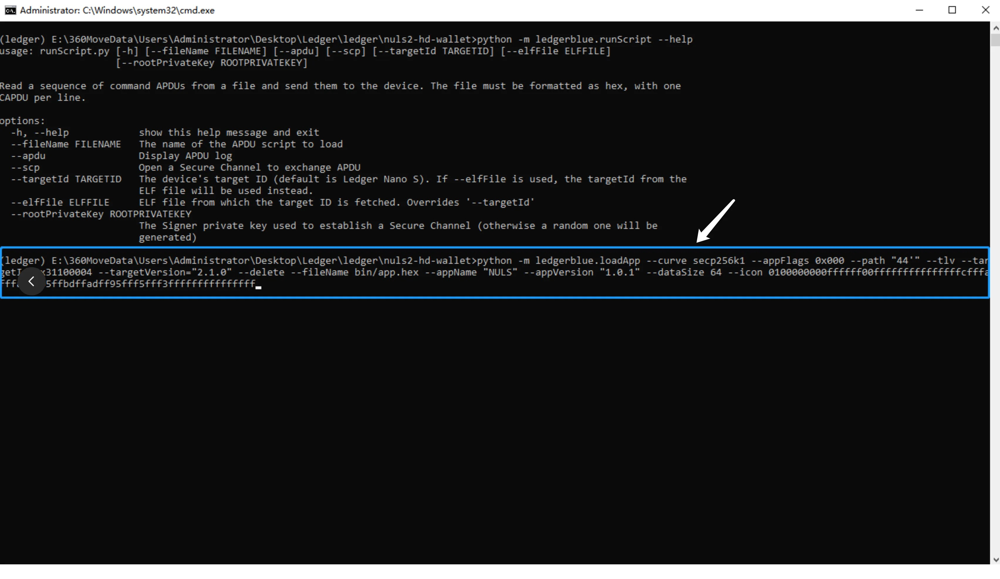
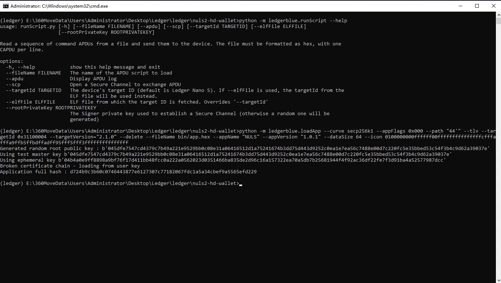

---


### NULS is Now Live on Ledger Wallet


The NULS hardware wallet has been submitted to the Ledger official and is going through the review process, which will meet you guys on Ledger Live soon. However, the listing process takes longer than we expected, as a result of that, we also provided another developer‘s version which is available now for crypto enthusiasts and early adopters. If you‘re an owner of a Ledger Wallet, keep reading, you will find out how to install the NULS App on your Ledger Wallet in a few minutes!


---


**Compatible operational environment**: Windows 10 / Windows 11

**Useful resource：**

NULS hardware wallet Github:[ ](https://github.com/nuls-io/app-nuls)[https://github.com/nuls-io/app-nuls](https://github.com/nuls-io/app-nuls)

Ledger Installation tool SDK Github:[ ](https://github.com/LedgerHQ/ledger-blue)[https://github.com/LedgerHQ/ledger-blue](https://github.com/LedgerHQ/ledger-blue)

**Note**

For the convenience of users, we have developed this manual installation tool. The current version is only compatible with Windows 10/11 devices. If you are a developer, you can use Ledger’s official tutorial to install it directly on Linux or Mac OS.

**Before installing, connect your Ledger Wallet to a Windows 10 / Windows 11 device.**


---


#### Step 1: Download the file to install

#### Download files to your Windows 10 / Windows 11 devices to begin

Link to download:[ ](https://github.com/nuls-io/app-nuls/tree/main/hd-wallet)[https://github.com/nuls-io/app-nuls/tree/main/hd-wallet](https://github.com/nuls-io/app-nuls/tree/main/hd-wallet)

**Reminder — MD5 verification is highly recommended**

To verify that the installation package is authentic and provided by NULS official team, it is highly recommended to check MD5 before you install it

MD5 (hd-wallet/nuls2-hd-wallet.zip) = aafb1cb668cba0c2e455f22c4bb201ed


---


#### Step 2: Unzip the file

Once the file is downloaded and saved to your device, unzip the files, then open File: “nuls2-hd-wallet”


#### Step 3 : Open: “start.bat”


#### Step 4: Verify your device environment

Run the code to verify the operational environment.

```plain
python -m ledgerblue.runScript --help
```


The system will now begin to check the local environment as shown in the image below:


#### Step 5: Installation

Proceed to install the NULS App by running the code 

```plain
python -m ledgerblue.loadApp --curve secp256k1 --appFlags 0x000 --path "44'" --tlv --targetId 0x31100004 --targetVersion="2.1.0" --delete --fileName bin/app.hex --appName "NULS" --appVersion "1.0.1" --dataSize 64 --icon 0100000000ffffff00fffffffffffffffcfffafffa9ffb5ffbdffadff95fff5fff3fffffffffffffff

```




Press “enter” to continue:



#### Step 6: Ledger Wallet asks for confirmation

Now your Ledger Wallet wakes up and asks to “Allow unsafe manager” : 


At the same time, you should carefully review the information that is showing on your Ledger Wallet, which includes :

**The NULS App version** : 1.0.0


**Identifier**


**Code Identifier**


#### Step 7: Perform installation

Once you confirm everything, you can now perform the installation.


#### Step 8: Type your passcode


#### Step 9: Installation completed


Now you have successfully installed the NULS App on the Ledger Wallet! 


---


### Contact Us

[Website](http://nuls.io/)

[Telegram](https://t.me/Nulsio)

[Reddit](https://www.reddit.com/r/nulsservice/)

[Twitter](https://twitter.com/Nuls)

[Facebook](https://www.facebook.com/nulscommunity/)

[GitHub](https://github.com/nuls-io)

***NULS — Making It Easier To Innovate***


